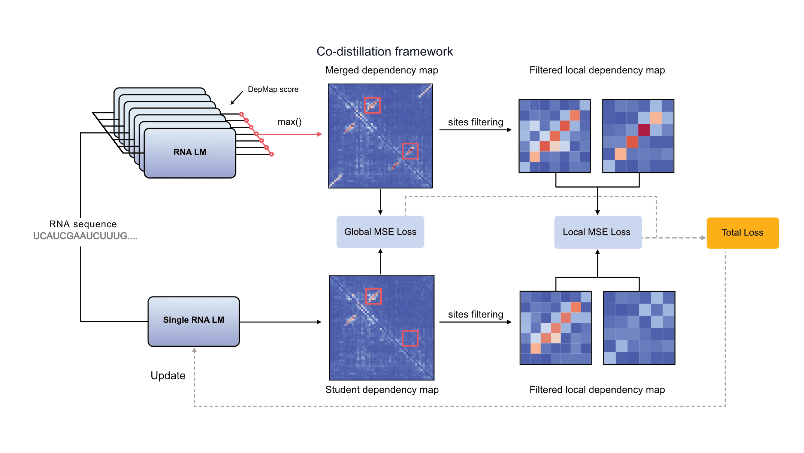

# RNAcompass: Conserved RNA structure prediction from single sequences

- [Installation](#installation)
- [Quick start](#quick-start)
- [Usage](#usage)
- [Reproducibility](#reproducibility)
- [License](#license)

RNAcompass is a co-distilled RNA language model for identifying conserved RNA
structural signals from a single sequence. This repository provides the public
v1 inference pipeline, from dependency-map generation to candidate base pairs
and helices.

The associated manuscript, *Distilling complementary knowledge across RNA
language models reveals conserved structures from single sequences*, is in
preparation.

<p align="center">
  
</p>

- **Pretrained weights:** The verified v1 weight archive is available from the
  corresponding author, Lei Sun ([sunlei0227@sdu.edu.cn](mailto:sunlei0227@sdu.edu.cn)),
  while a permanent public archive is being prepared. See the
  [weight specification](docs/weights.md).
- **Reproducibility:** A reference input and expected outputs are included in
  the repository. See the [validation guide](docs/reproducibility.md).

## Installation

RNAcompass requires Linux, Conda, and an NVIDIA GPU with a CUDA 11.3-compatible
driver. The reference environment uses Python 3.9.16.

```bash
conda env create -f environment.yml
conda activate rnacompass
python -m pip install -e .
```

CPU inference is not supported in v1.

## Quick start

Install the downloaded weight archive, check the environment, and run the
example sequence:

```bash
rnacompass weights install --archive /path/to/rnacompass-weights-v1.tar.gz
rnacompass preflight --device cuda:0
rnacompass run --fasta examples/RF00001.fa --output-dir output --device cuda:0
```

## Usage

RNAcompass accepts one FASTA file or a directory of `.fa`, `.fasta`, and `.fna`
files. To process a directory:

```bash
rnacompass run \
  --fasta-dir /path/to/fastas \
  --output-dir output \
  --device cuda:0 \
  --batch-size 4
```

Use `--dry-run` to validate inputs without loading PyTorch or the model weights:

```bash
rnacompass run --fasta examples/RF00001.fa --output-dir output --dry-run
```

Each sample produces dependency maps, predicted base pairs and helices, a JSON
summary, and PDF/SVG/PNG heatmaps under `output/results/<sample>/`. The model
supports sequences up to 1,022 nt. Run `rnacompass run --help` for all options.

## Reproducibility

The CPU test suite covers input handling, structural filtering, output schemas,
weight validation, and packaging:

```bash
python -m pip install -e ".[test]"
pytest -m "not gpu"
```

GPU reference validation and acceptance criteria are documented in
[docs/reproducibility.md](docs/reproducibility.md).

## License

RNAcompass source code and trained model parameters are released under the
[MIT License](LICENSE), which also preserves the notice for the bundled
ERNIE-RNA-derived source code.
